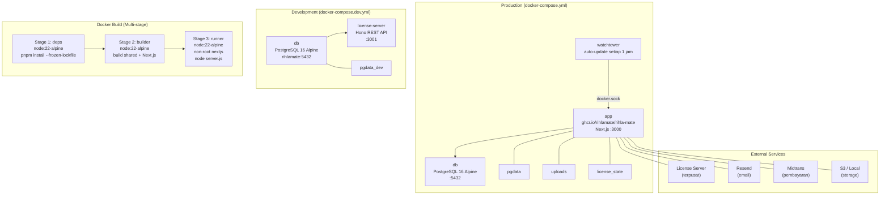
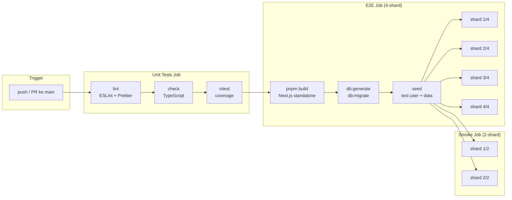

# Rihla Mate

Platform white-label travel Umrah self-hosted. Setiap travel agent deploy di server sendiri (Docker Compose), mendapatkan landing page branded, dashboard admin, dan booking engine — semua di bawah lisensi yang dikelola melalui license server terpusat.

> **Prinsip**: Satu install = satu travel agent. Tidak ada multi-tenant shared infrastructure.

## Tech Stack

| Layer     | Technology                                  |
| --------- | ------------------------------------------- |
| Framework | Next.js 16 (App Router)                     |
| Language  | TypeScript (strict)                         |
| Styling   | Tailwind CSS v4 + shadcn/ui                 |
| Database  | PostgreSQL (Docker)                         |
| ORM       | Drizzle ORM                                 |
| Auth      | Better Auth (email/password + Google OAuth) |
| API       | tRPC v11                                    |
| License   | Ed25519 (`@noble/ed25519`)                  |
| Email     | Resend                                      |
| Payments  | Midtrans (GoPay, OVO, Dana, QRIS)           |
| i18n      | next-intl (ID + EN)                         |

## Quick Start (Development)

```bash
# Prerequisites: Node.js 22, pnpm 9, PostgreSQL

# 1. Clone & install
git clone <repo-url> && cd rihla-mate
pnpm install

# 2. Environment
cp apps/app/.env.example apps/app/.env
# Edit apps/app/.env — set DATABASE_URL, BETTER_AUTH_SECRET

# 3. Database
pnpm db:generate
pnpm db:migrate

# 4. Run
pnpm dev
# Open http://localhost:3000
```

## Production Deployment (Customer Side)

```bash
# 1. Download files
curl -O https://releases.rihla-mate.com/latest/docker-compose.yml
curl -O https://releases.rihla-mate.com/latest/.env.example
cp .env.example .env

# 2. Edit .env — set required secrets
# 3. Start
docker compose up -d
# Open http://<server-ip>:3000 → Installer wizard
```

## Project Structure

```
rihla-mate/
├── apps/app/                  # Next.js app (self-hosted)
│   ├── src/
│   │   ├── app/               # App Router pages
│   │   ├── lib/
│   │   │   ├── license/       # License enforcement module
│   │   │   ├── tenant/        # Tenant resolution
│   │   │   ├── db/            # Drizzle schema + client
│   │   │   ├── auth/          # Better Auth config
│   │   │   └── installer/     # Installer wizard logic
│   │   ├── instrumentation.ts # Background check-in scheduler
│   │   └── middleware.ts      # License + tenant middleware
│   ├── docker-compose.yml     # Production deployment
│   └── Dockerfile
├── packages/shared/           # Types shared with license server
├── license-server/            # Hono REST API (license management)
├── scripts/                   # Test scripts, keygen, build tools
├── templates/                 # Landing page templates
└── docs/                      # Documentation
```

## Scripts

| Command            | Description                          |
| ------------------ | ------------------------------------ |
| `pnpm dev`         | Start development server (Turbopack) |
| `pnpm build`       | Build all packages                   |
| `pnpm check`       | TypeScript type checking             |
| `pnpm lint`        | ESLint across all packages           |
| `pnpm test`        | Run unit tests (Vitest)              |
| `pnpm db:generate` | Generate Drizzle migrations          |
| `pnpm db:migrate`  | Apply Drizzle migrations             |
| `pnpm keygen`      | Generate Ed25519 license key pair    |

## Infrastructure & CI

### Arsitektur Infrastruktur



### CI/CD Pipeline



### CI/CD (GitHub Actions)

Dua workflow, keduanya trigger `push` dan `pull_request` ke `main`.

| Workflow               | Shard | Pipeline                                                                    |
| ---------------------- | ----- | --------------------------------------------------------------------------- |
| `playwright.yml`       | 4     | lint → check → DB migrate → seed → **E2E (4-shard)** + unit test coverage   |
| `playwright-smoke.yml` | 2     | lint → check → DB migrate → seed → **Smoke (2-shard)** + unit test coverage |

**Setup CI**: `ubuntu-latest`, Node 20, pnpm 9 (corepack), PostgreSQL 16 service container. Coverage dan Playwright report di-upload sebagai artifact (7 hari retensi).

### Docker

**Production** (`docker-compose.yml`):

- `app` — image `ghcr.io/rihlamate/rihla-mate:latest`, port 3000, health check `/api/health`
- `db` — PostgreSQL 16 Alpine, health check `pg_isready`
- `watchtower` — auto-update container setiap 1 jam
- Volume: `pgdata`, `uploads`, `license_state`

**Development** (`docker-compose.dev.yml`):

- `db` — PostgreSQL 16 Alpine, user `rihlamate`
- `license-server` — build dari `./license-server`, port 3001, Upstash Redis

**Dockerfile**: 3-stage build (`node:22-alpine`):

1. **deps** — install dependencies (`pnpm install --frozen-lockfile`)
2. **builder** — build shared package + Next.js standalone output
3. **runner** — non-root `nextjs` user, `node apps/app/server.js`

### Spesifikasi Server

| Komponen    | Minimum                  | Rekomendasi                  |
| ----------- | ------------------------ | ---------------------------- |
| **CPU**     | 2 vCPU                   | 4 vCPU                       |
| **RAM**     | 2 GB                     | 4 GB                         |
| **Storage** | 20 GB SSD                | 50 GB SSD                    |
| **OS**      | Ubuntu 22.04 / Debian 12 | Ubuntu 24.04                 |
| **Docker**  | Docker 24+ + Compose v2  | Docker 27+                   |
| **Network** | Static IP atau domain    | Domain + SSL (reverse proxy) |

**Catatan**:

- Storage dihitung untuk OS, image Docker, database, dan upload file. Gunakan SSD untuk performa database PostgreSQL.
- RAM 2 GB cukup untuk 1-2 travel agent dengan traffic rendah. Tambah RAM jika concurrent user meningkat.
- Reverse proxy (Nginx/Caddy) direkomendasikan di depan container untuk SSL termination.
- PostgreSQL 16 Alpine dan Node.js 22 sudah termasuk dalam Docker image — tidak perlu install manual.

#### Spesifikasi License Server (Terpusat)

License server adalah service terpisah yang dikelola oleh Rihla Mate, tidak di-deploy oleh travel agent.

| Komponen               | Spesifikasi                                          | Keterangan                                                                              |
| ---------------------- | ---------------------------------------------------- | --------------------------------------------------------------------------------------- |
| **Runtime**            | Hono (Node.js)                                       | REST API ringan, port 3001                                                              |
| **CPU**                | 1-2 vCPU                                             | Beban rendah — hanya activation + check-in berkala                                      |
| **RAM**                | 1-2 GB                                               | Memory footprint kecil (Hono ~50 MB idle)                                               |
| **Database**           | PostgreSQL 16                                        | Skema: `customers`, `licenses`, `activations`, `checkins`, `domain_changes`, `api_keys` |
| **Cache / Rate Limit** | Upstash Redis                                        | Rate limiting per license (check-in: 60 req/mnt, endpoint lain: 10 req/mnt)             |
| **Email**              | Resend                                               | Kirim license key ke customer                                                           |
| **Keamanan**           | Ed25519 + API Key                                    | Sign/verify license key, API key auth untuk endpoint admin                              |
| **Endpoint**           | `/api/v1/health`, `/activate`, `/checkin`, `/revoke` | 4 endpoint REST                                                                         |

**Estimasi beban**:

- Setiap travel agent check-in sekali per 24 jam → 1 request/hari/instance
- Activation hanya sekali saat install pertama
- Revoke hanya saat manual (admin) atau expired
- Untuk 10.000 instance: ~10.000 check-in/hari ≈ **0.12 req/detik** — sangat ringan

### Testing

| Layer          | Tool       | Konfigurasi                                                          |
| -------------- | ---------- | -------------------------------------------------------------------- |
| E2E            | Playwright | Chromium only, 1 worker, 60s timeout, CI retries=1, tracing on retry |
| Unit (app)     | Vitest     | v8 coverage: lines 10%, branches 75%, functions 40%, statements 10%  |
| Unit (license) | Vitest     | Minimal, no coverage                                                 |

### Linting & Formatting

| Tool       | Konfigurasi                                                                                   |
| ---------- | --------------------------------------------------------------------------------------------- |
| ESLint     | Flat config, `typescript-eslint` strict, `no-unused-vars` error, `no-non-null-assertion` warn |
| Prettier   | semi, double quotes, trailingComma all, printWidth 100                                        |
| TypeScript | Root: ES2022/strict/bundler. App: ES2017/DOM/react-jsx. License: ES2022/verbatimModuleSyntax  |

Pre-commit hook via **Husky** + **lint-staged**: prettier → eslint → vitest related → tsc (noEmit).

### Monorepo Tooling

| Tool            | Peran                                                                                                            |
| --------------- | ---------------------------------------------------------------------------------------------------------------- |
| **pnpm**        | Workspace manager (`apps/*`, `packages/*`), `pnpm@9.0.0` enforced                                                |
| **Turborepo**   | Pipeline: `build` (depends `^build`), `dev` (persistent, no cache), `lint`, `check`, `db:generate`, `db:migrate` |
| **Renovate**    | Weekend schedule, group non-major, automerge devDeps patch                                                       |
| **Drizzle Kit** | PostgreSQL dialect, schema → migration generation                                                                |

### Environment Variables

Lihat `.env.example` untuk template lengkap. Kategori:

- **Database**: `DATABASE_URL`
- **Auth**: `BETTER_AUTH_SECRET`, `BETTER_AUTH_URL`, Google OAuth credentials
- **License**: `LICENSE_KEY`, `LICENSE_SERVER_URL`, `LICENSE_PUBLIC_KEY`
- **Email**: Resend API key
- **Payments**: Midtrans server key, client key, merchant ID
- **Storage**: `STORAGE_DRIVER` (`local` atau `s3`), S3 credentials

### Deployment Satu Perintah

```bash
curl -fsSL https://releases.rihla-mate.com/install.sh | bash
```

Script `install.sh` akan: cek Docker + Docker Compose → buat `.env` dari template → pull image → `docker compose up -d` → verifikasi health endpoint.

## License Flow

1. Travel agent download `docker-compose.yml` + `.env` template
2. `docker compose up -d` → App starts in **TRIAL mode** (14 hari, full features)
3. Travel agent beli license → dapat license key via email
4. Buka installer wizard di `http://server-ip:3000/activate`
5. Masukkan license key → verifikasi offline (Ed25519) + online activation
6. Setiap 24 jam: app phone-home ke license server (`POST /checkin`)
7. Kalau license expired/revoked → grace period 7 hari → degrade ke starter

## License Key Format

```
RML1.<base64url(payload)>.<base64url(Ed25519 signature)>

Payload:
{
  licenseId, customerId, customerName,
  plan: "pro",
  features: ["multi_tenant", "custom_domain", "white_label", ...],
  maxTenants, maxMonthlyBookings,
  expiresAt, gracePeriodDays,
  isTrial, trialDays,
  apiUrl
}
```

## Development Plan

See [`.sisyphus/plans/rihla-mate-development-plan.md`](.sisyphus/plans/rihla-mate-development-plan.md) for the full roadmap across 6 phases:

- **Phase 0**: Foundation (monorepo, license module, auth)
- **Phase 1**: Installer & activation wizard
- **Phase 2**: Landing pages & templates
- **Phase 3**: Booking engine + Midtrans
- **Phase 4**: Admin dashboard & polish
- **Phase 5**: Multi-tenant, i18n, scale
